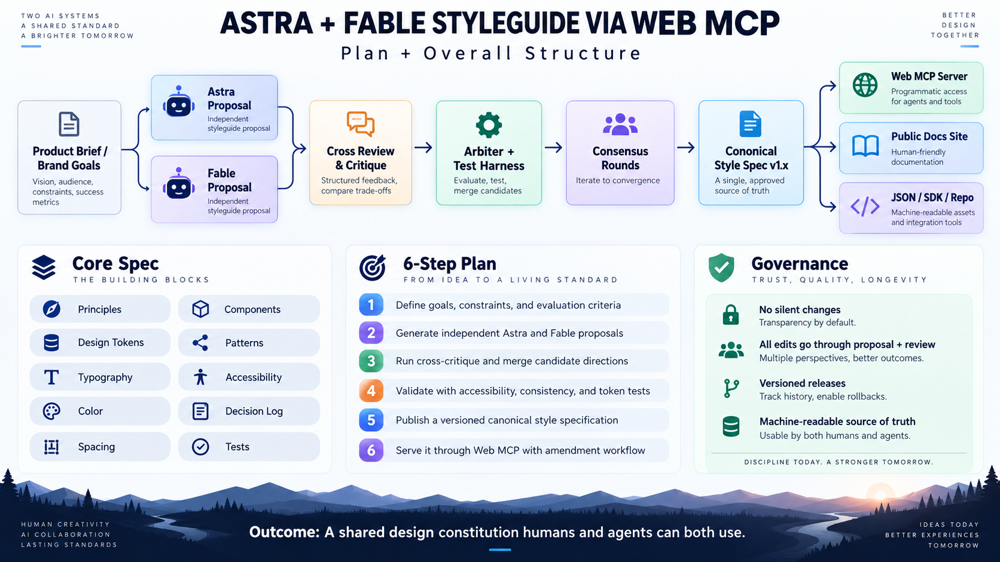

# Astra + Fable Style Constitution

**Two independent design agents. One governed design standard. Available to humans and machines through MCP.**



Astra + Fable Style Constitution turns design rules into a versioned, machine-readable contract. Two provider-independent agent roles propose and critique changes; deterministic checks resolve measurable questions; exact candidate hashes prevent fake consensus; humans retain release authority by default.

The project idea was inspired by Tibo's post on X.

## What it gives you
- A canonical StyleSpec under `/spec`.
- Independent Astra/Fable proposal and cross-review workflow, including an optional one-call product-brief-to-candidate path.
- Deterministic token, accessibility, component, and governance checks.
- MCP resources and tools for coding agents.
- Generated CSS, JSON, and TypeScript artifacts.
- A human documentation site.
- Audit-friendly decisions and proposal records.

## Quick verification without external dependencies
The repository includes a dependency-light verification path for the core engine:

```bash
npm run verify:core
```

The full connected build uses pnpm and installs the official MCP SDK, Astro, Zod, ESLint, and TypeScript:

```bash
pnpm install
pnpm verify
```

## Validate a local StyleSpec

The draft v0.3 CLI currently implements `stylecon validate` only. From this repository, run `pnpm build` and then `pnpm stylecon validate`. The command reads the `/spec` directory in the current working directory; use `--root <directory>` to select another project. It exits 0 for a valid spec, 1 for rule violations, and 2 for a missing or unreadable spec or invalid command. The CLI package is not published to a registry.

## Production MCP
The production adapter targets MCP `2026-07-28` via the official v2 TypeScript packages and `createMcpHandler`. The public endpoint is read-oriented by default. Write/release workflows remain governance-gated. When explicitly enabled, `generate_style_constitution_candidate` can invoke configurable OpenAI, Anthropic, or local Ollama-backed roles from a product brief; generated candidates still require exact-hash approvals. The optional release tool is separately disabled by default and requires a distinct human-held approval credential. Operator governance remains process-local, with optional local audit evidence and separate role approval credentials; see [GOVERNANCE.md](GOVERNANCE.md).

The public server is available below. Check `/version` for the version currently serving; the immutable v0.1.0 release and snapshot remain available.

| Endpoint | URL |
| --- | --- |
| MCP (Streamable HTTP) | `https://astra-fable-styleguide-mcp.vercel.app/mcp` |
| Health | `https://astra-fable-styleguide-mcp.vercel.app/health` |
| Version | `https://astra-fable-styleguide-mcp.vercel.app/version` |

The public deployment exposes eight read and compliance tools: `get_style_manifest`, `get_design_tokens`, `get_component_rules`, `search_style_spec`, `explain_style_decision`, `validate_tokens`, `check_style_compliance`, and `compare_spec_versions`. Proposal, approval, orchestration, and release tools are disabled. No provider key is needed to use the public endpoint.

For a client that accepts a Streamable HTTP MCP URL, configure the server URL as `https://astra-fable-styleguide-mcp.vercel.app/mcp`. For example, a Cursor `.cursor/mcp.json` entry is:

```json
{
  "mcpServers": {
    "style-constitution": {
      "url": "https://astra-fable-styleguide-mcp.vercel.app/mcp"
    }
  }
}
```

See [`docs/DEPLOYMENT.md`](./docs/DEPLOYMENT.md) for deployment settings and verification commands, and [`docs/CLIENT_TRIALS.md`](./docs/CLIENT_TRIALS.md) for actual Codex CLI, Cursor CLI, and MCP Inspector results. Cursor CLI required explicit per-tool approval for its noninteractive trial; the example server configuration alone does not grant tool access.

For a machine-readable check of MCP discovery, protocol negotiation, version, and the eight advertised read tools, build the repository SDK and run `node scripts/probe-mcp.mjs https://astra-fable-styleguide-mcp.vercel.app/mcp`. See [`docs/TYPESCRIPT_CLIENT.md`](./docs/TYPESCRIPT_CLIENT.md) for the client API and probe output.

The next compliance implementation reports source locations and explicit coverage limits. See [`docs/COMPLIANCE.md`](./docs/COMPLIANCE.md) for its result contract.

For a TypeScript integration, see the [local client quickstart](./docs/TYPESCRIPT_CLIENT.md).

Historical comparisons use [immutable `/spec` snapshots](./docs/VERSIONING.md).

See the [v0.2.0 release notes](./docs/V0.2.0_RELEASE_NOTES.md) for the design delta, compatibility, and governance scope. The [implementation plan](./docs/V0.2_PLAN.md) records the delivery criteria.

## Project contract
- Goal: [`GOAL.md`](./GOAL.md)
- Build requirements: [`BUILD_SPEC.md`](./BUILD_SPEC.md)
- Agent rules: [`AGENTS.md`](./AGENTS.md)
- Governance: [`GOVERNANCE.md`](./GOVERNANCE.md)
