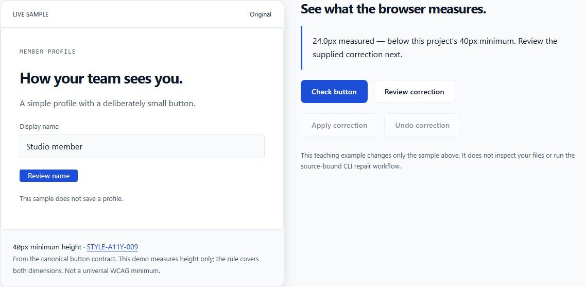
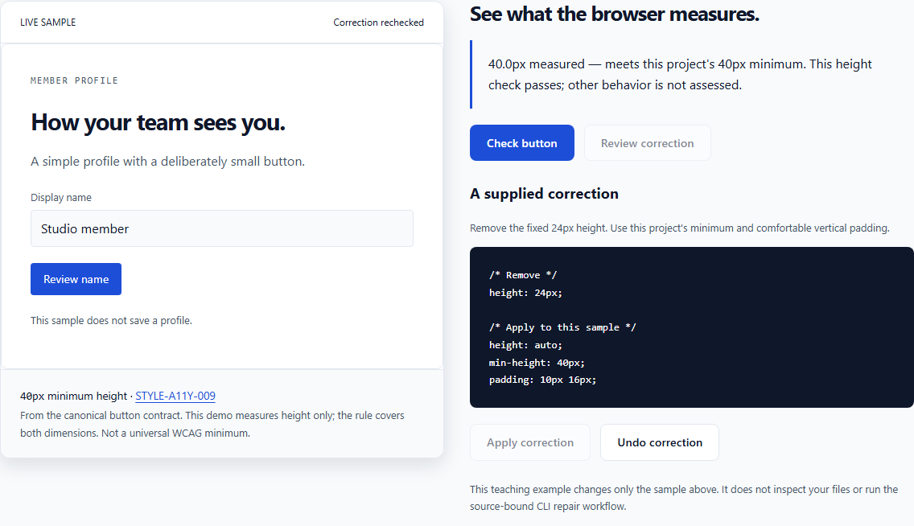
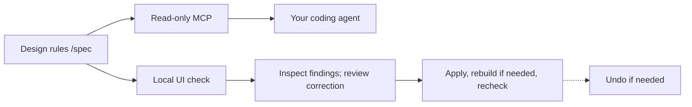
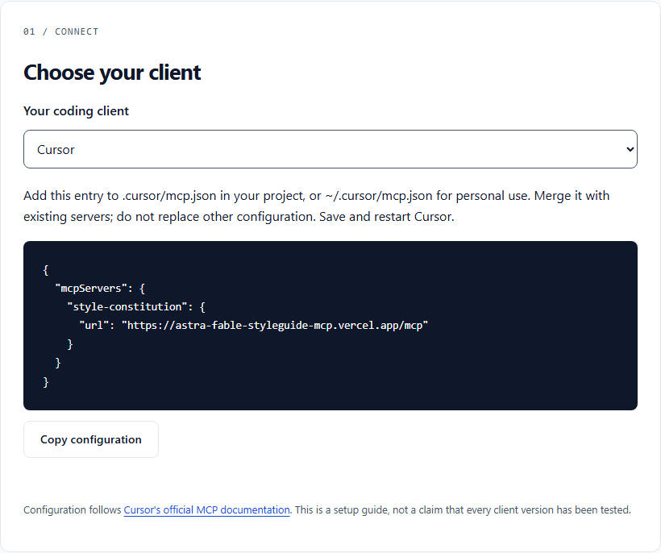
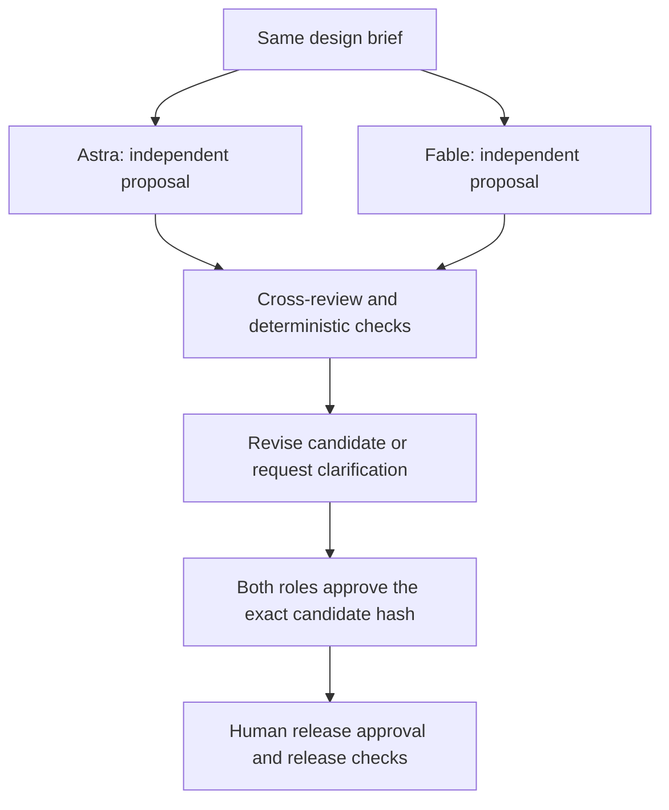

# Astra + Fable Style Constitution

**Give your coding agent shared design rules. Check the UI. Review the correction.**

A versioned design contract, a read-only MCP server for coding agents, and a local UI checker with reviewed repairs. For developers who want their interfaces to follow the same rules as their code changes.

[**Try the demo →**](https://sulabhdubey.github.io/astra-fable-styleguide-mcp/demo/) · [Connect your agent](https://sulabhdubey.github.io/astra-fable-styleguide-mcp/start/) · [Install locally](docs/INSTALLATION.md) · [v0.8.0 release](https://github.com/sulabhdubey/astra-fable-styleguide-mcp/releases/tag/v0.8.0)

## See a check in action

The browser measures a **24px button**, flags it against this project's **40px rule**, then measures again after you approve a supplied correction.

**1 · Find the mismatch**



**2 · Apply and recheck**



Actual v0.7.0 demo screenshots. This sample checks button height only; 40px is a project rule, not a universal accessibility minimum. **[Try it without an account, install or AI call.](https://sulabhdubey.github.io/astra-fable-styleguide-mcp/demo/)**

## How it works


```mermaid
flowchart LR
  Rules["Design rules /spec"] --> MCP["Read-only MCP"]
  MCP --> Agent["Your coding agent"]
  Rules --> Check["Local UI check"]
  Check --> Review["Inspect findings; review correction"]
  Review --> Recheck["Apply, rebuild if needed, recheck"]
  Recheck -.-> Undo["Undo if needed"]
```

| You want to… | Start with… |
| --- | --- |
| Give an agent consistent tokens and component rules | [Public MCP setup](#production-mcp) |
| Inspect a supported interface and review corrections | [Local Studio](docs/LOCAL_STUDIO.md) · [React/Vite guide](docs/RUNNING_APP.md) |
| Create and pin your team's design contract | [Constitution authoring](docs/CONSTITUTION_AUTHORING.md) |
| See new, resolved and incomplete checks in a PR | [PR regression summaries](docs/PR_REGRESSIONS.md) |
| Hand findings to an agent, revisit history, or adopt team rules | [Individual and team workflows](docs/INDIVIDUAL_AND_TEAM_WORKFLOWS.md) — development source; not in v0.8.0 |

## Start locally

Use **Node 22.12+** and **pnpm 10.34.5** in this repository:

```sh
pnpm install --frozen-lockfile
pnpm build
pnpm stylecon browser-install
pnpm stylecon check examples/profile
```

Prefer the packaged CLI? Follow the [verified installation guide](docs/INSTALLATION.md). The CLI is distributed as a release archive; **it is not published to npm**.

## Production MCP

Add this to your client's MCP configuration; merge it with existing servers:

```json
{
  "mcpServers": {
    "style-constitution": {
      "url": "https://astra-fable-styleguide-mcp.vercel.app/mcp"
    }
  }
}
```

Eight public read/compliance tools. No provider key required. The server supplies rules and checks submitted values; it cannot inspect or edit your local files. [Client trial evidence](docs/CLIENT_TRIALS.md) · [TypeScript SDK](docs/TYPESCRIPT_CLIENT.md)

<details>
<summary>See the guided connection screen</summary>



[Open guided setup](https://sulabhdubey.github.io/astra-fable-styleguide-mcp/start/) · [Health](https://astra-fable-styleguide-mcp.vercel.app/health) · [Version](https://astra-fable-styleguide-mcp.vercel.app/version)

</details>

## Why Astra + Fable?

Two configurable agent roles independently propose design changes, then review them. They are roles, not fixed model vendors.


```mermaid
flowchart TD
  Brief["Same design brief"] --> A["Astra: independent proposal"]
  Brief --> F["Fable: independent proposal"]
  A --> Review["Cross-review and deterministic checks"]
  F --> Review
  Review --> Candidate["Revise candidate or request clarification"]
  Candidate --> Approval["Both roles approve the exact candidate hash"]
  Approval --> Human["Human release approval and release checks"]
```

A changed candidate invalidates prior approvals. Unresolved requirements and pending checks block release. **Collaboration is experimental; an overall advantage over a single agent has not been demonstrated.** [Governance](GOVERNANCE.md) · [Measured comparison](docs/SELECTIVE_REVIEW_STUDY.md)

## Supported scope

- Configured static UI journeys and trusted local React/Vite production previews.
- Selected typography, spacing, contrast, overflow and interaction checks; [browser coverage](docs/RUNNING_APP.md) · [source-text checks](docs/COMPLIANCE.md).
- Supported repairs require explicit source mappings. React/Vite literal CSS corrections require a trusted rebuild before rechecking.
- Experimental [Dembrandt token comparison](docs/DEMBRANDT_TOKENS.md) checks declared colors against a versioned export using a controlled local render.
- Experimental software: no complete accessibility certification, arbitrary-framework coverage or autonomous repair guarantee.

## Go deeper

[Quickstart](docs/START_HERE.md) · [Repair walkthrough](docs/DEMO.md) · [Release notes](docs/V0.8.0_RELEASE_NOTES.md) · [Changelog](CHANGELOG.md) · [Deployment](docs/DEPLOYMENT.md)

<details>
<summary>Contributing and verification</summary>

```sh
pnpm install
pnpm lint
pnpm typecheck
pnpm test
pnpm validate
pnpm build
```

After installing Chromium, `pnpm test:product` checks the built product pages. CI requires no external AI calls.

[Project goal](GOAL.md) · [Build specification](BUILD_SPEC.md) · [Agent rules](AGENTS.md) · [Versioning](docs/VERSIONING.md)

</details>

Inspired by Tibo's post on X.
