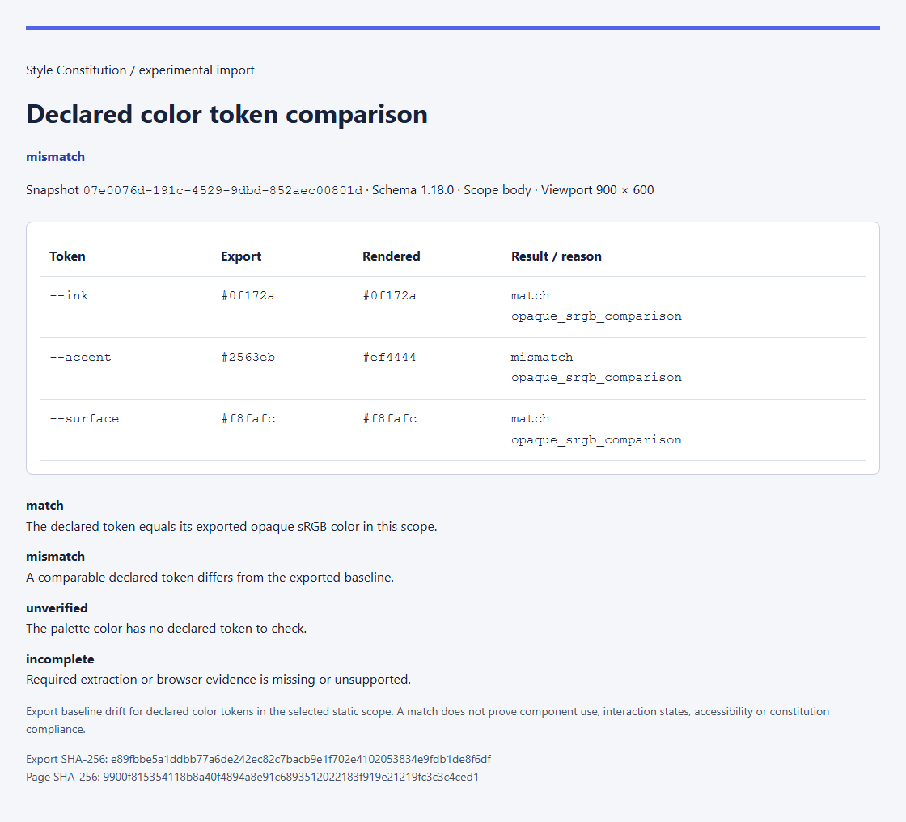
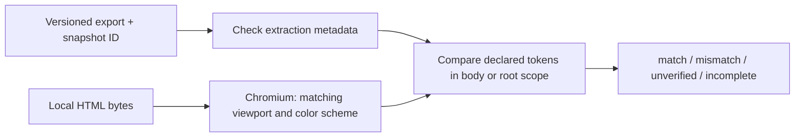

# Declared color token verification

Compare a versioned Dembrandt export with a **self-contained local HTML page**, using a real Chromium render at the export's viewport. This experimental CLI command observes baseline drift. Imported colors require review before becoming constitution rules.





## Try the recorded example

Use a checkout containing this feature. The released v0.8.0 CLI predates this command.

```sh
pnpm install --frozen-lockfile
pnpm --filter @styleconstitution/cli build
node packages/cli/dist/stylecon.mjs browser-install
node packages/cli/dist/stylecon.mjs tokens check examples/dembrandt/export.json examples/dembrandt/page.html
node packages/cli/dist/stylecon.mjs tokens check examples/dembrandt/export.json examples/dembrandt/page.html --format html --output token-report.html
```

Reports are created exclusively and must be outside the rendered page's directory. Choose a new output filename for each run. JSON output is available with `--format json`.

The example's `meta` and `colors` are an unchanged color-only excerpt from a real **Dembrandt 0.38.0 / schema 1.18.0** extraction of the accompanying local page at **900 × 600**. Its original loopback URL identifies the extraction session; checking the selected HTML file does not reconnect to that URL. All three declared tokens match. The export's `snapshotId` and SHA-256 identify the baseline; the page SHA-256 identifies the checked HTML bytes.

In a copy of the HTML, change `--accent: #2563eb` to `--accent: #ef4444` and recheck: that token becomes **mismatch**. Remove the `--accent` declaration and recheck: it becomes **incomplete**. Checking never changes either input.

## Read the results

| Result | Meaning |
| --- | --- |
| **match** | The computed declared token equals the exported opaque color at 8-bit sRGB precision. |
| **mismatch** | Comparable declared-token evidence differs from the exported baseline. |
| **unverified** | A palette color has no declared token to check. |
| **incomplete** | Required metadata, token value or browser evidence is missing, contradictory or unsupported. |

The aggregate prioritizes incomplete, then mismatch, then unverified, then match. Exit codes are **0** for all match, **1** for mismatch without incomplete checks, and **2** for unverified/incomplete or a usage/runtime error.

## Contract and scope

- Exact supported `meta.schemaVersion` values: **1.17.0 and 1.18.0**. Unknown or missing versions are incomplete; compatibility is never inferred from JSON shape.
- Required evidence: successful `meta.httpStatus`, `meta.snapshotId`, and a valid `meta.viewport`. Color-scoped `degraded` categories or `errors` block comparison. Unrelated category failures and `fontsReady: false` remain visible warnings because this command checks color tokens only.
- `colors.palette[].tokens` identifies declared custom properties; `normalized` supplies the expected six-digit color. Conflicting token baselines or contradictory `colors.cssVariables[token].hex` evidence are incomplete. Names remain case sensitive.
- **Default scope: body.** This reads body declarations and inherited root tokens. Use `--scope root` to read only the root context. An override can produce different results; the report records the chosen scope.
- The browser matches viewport dimensions and the recorded light/dark color scheme. Mobile, stealth, alternate browser and custom locale/user-agent/timezone profiles are unsupported. Multi-page merged exports are incomplete.
- The chosen HTML must contain its styles and scripts. No external network, additional local files, frames or service workers are available. Blocked resources, script errors and timed-out observations produce incomplete checks. Only choose HTML you trust: inline JavaScript executes in the isolated browser context.
- Supported literal opaque colors are compared through the browser. Transparent colors, contextual `currentColor`/`light-dark()` and nested expressions (including `calc()`) are incomplete. `color-mix()` support is limited to flat sRGB mixes of named/hex colors whose weights preserve opacity; nested or partial-opacity mixes are incomplete. The comparison is intentionally limited to 8-bit sRGB; it does not establish exact wide-gamut equivalence.
- No per-color source element or interaction state is invented. A token match does not prove that a component uses it, that the original website was authentic, or that the selected local page matches a remote build. A baseline mismatch becomes a constitution violation only after the expected rule is deliberately approved.

## Verification and upstream references

```sh
node --test tests/dembrandt-tokens.test.mjs
node scripts/test-dembrandt-tokens.mjs
```

The browser suite checks the native recorded export, equivalent RGB and modern color notation, root/body overrides, responsive and dark-mode values, changed/missing tokens, transparency, extraction failures, blocked resources, script errors and CLI output protections. Synthetic 1.17.0 contract fixtures cover the prior schema explicitly. CI performs no external AI calls or live Dembrandt extraction.

The contract was inspected at [Dembrandt commit b4b827b](https://github.com/dembrandt/dembrandt/tree/b4b827b135b7c8c265fb775b30c5c1a6acc318fa): [types](https://github.com/dembrandt/dembrandt/blob/b4b827b135b7c8c265fb775b30c5c1a6acc318fa/lib/types.ts), [schema history](https://github.com/dembrandt/dembrandt/blob/b4b827b135b7c8c265fb775b30c5c1a6acc318fa/lib/version.ts).
